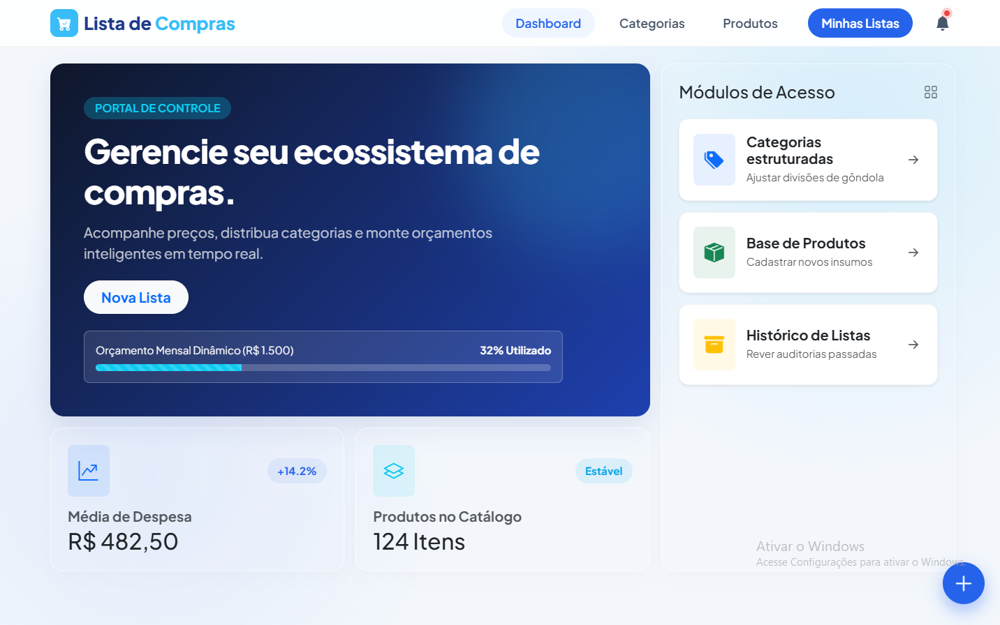

# 🛒 LISTA DE COMPRAS | Sistema de Gestão de Compras Residências 🚀

> **Controle inteligente de categorias, produtos e listas para organizar as compras da família.**

---

# 📌 Sobre o Projeto

O **Lista de Compras** foi desenvolvido para ajudar a Maria a organizar as compras da família semanalmente, evitando o esquecimento de itens essenciais ou a compra duplicada de produtos que já existem em estoque doméstico.

---

### 🗂️ Módulo de Categorias
> **Ações Suportadas:** `Cadastrar` | `Editar` | `Excluir` | `Visualizar`

| Parâmetro | Regra de Negócio |
| :--- | :--- |
| **Identificação** | Nome obrigatório, único e com limite máximo de 50 caracteres. |
| **Customização** | Definição de Cor através de seleção de paleta ou código Hexadecimal. |
| **Segurança** | Bloqueio automático de exclusão se houver produtos vinculados à categoria. |

---

### 📦 Módulo de Produtos
> **Ações Suportadas:** `Cadastrar` | `Editar` | `Excluir` | `Visualizar`

| Parâmetro | Regra de Negócio |
| :--- | :--- |
| **Validação** | Nome obrigatório (2 a 100 caracteres) e combinação única de Nome + Categoria. |
| **Vínculo** | Associação obrigatória a uma categoria previamente cadastrada. |
| **Métricas** | Definição obrigatória da unidade de medida (kg, un, L, cx) e preço aproximado. |

---

### 📝 Módulo de Listas de Compras
> **Ações Suportadas:** `Criar` | `Editar` | `Excluir` | `Visualizar`

| Parâmetro | Regra de Negócio |
| :--- | :--- |
| **Identificação** | Nome da lista obrigatório (3 a 100 caracteres) e data de criação automática. |
| **Status** | Controle de ciclo de vida da lista de compras: `Aberta` \| `Concluída`. |
| **Restrições** | Bloqueio de exclusão se houver itens vinculados; exibição de totalizadores. |

---

### 🍎 Módulo de Itens da Lista
> **Ações Suportadas:** `Adicionar Item` | `Remover Item` | `Visualizar Itens`

| Parâmetro | Regra de Negócio |
| :--- | :--- |
| **Vínculo** | Seleção obrigatória do produto com exibição visual de sua categoria. |
| **Quantidade** | Definição de quantidade estritamente positiva (maior que zero). |
| **Cálculos** | Impede produtos duplicados na mesma lista; calcula valor estimado total automaticamente. |

---

# 🧠 Conceitos Aplicados

| Conceito | Aplicação |
|---|---|
| 🏗️ POO | Modelagem das entidades físicas e lógicas do sistema de compras |
| 📐 Camadas | Separação estrita de responsabilidades (MVC) |
| ⚙️ Regras | Validação robusta contra duplicidade de produtos e exclusões indevidas |

## 👨‍💻 Autores

Desenvolvido por **Alunos da Academia do Programador**.

